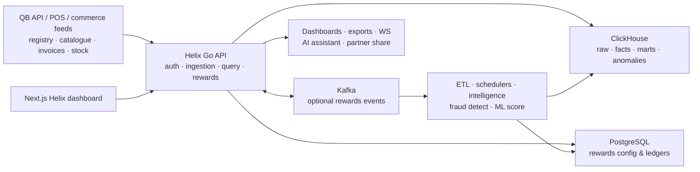
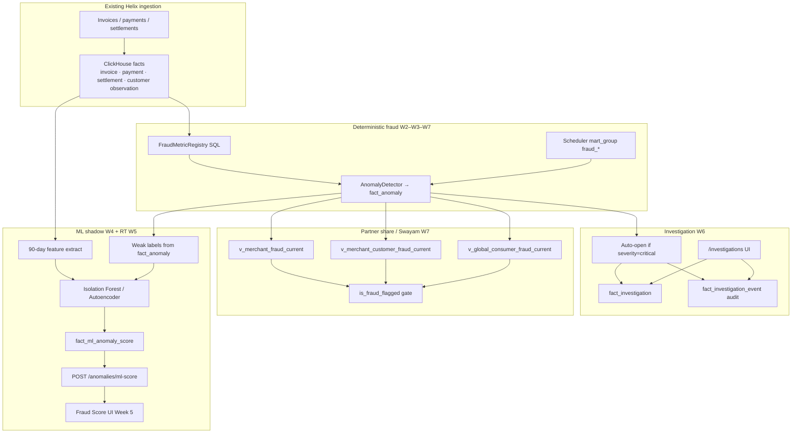
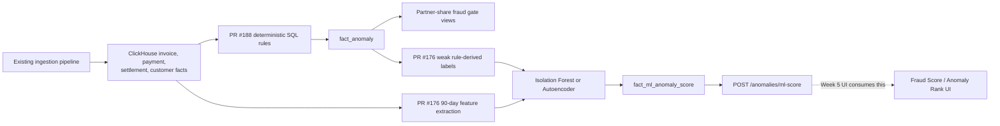
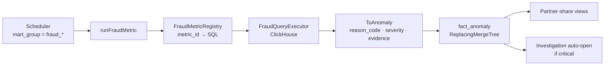
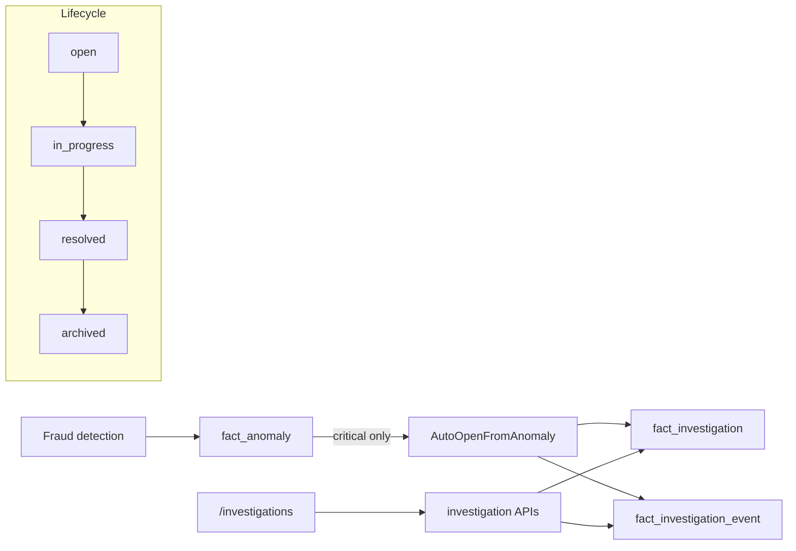
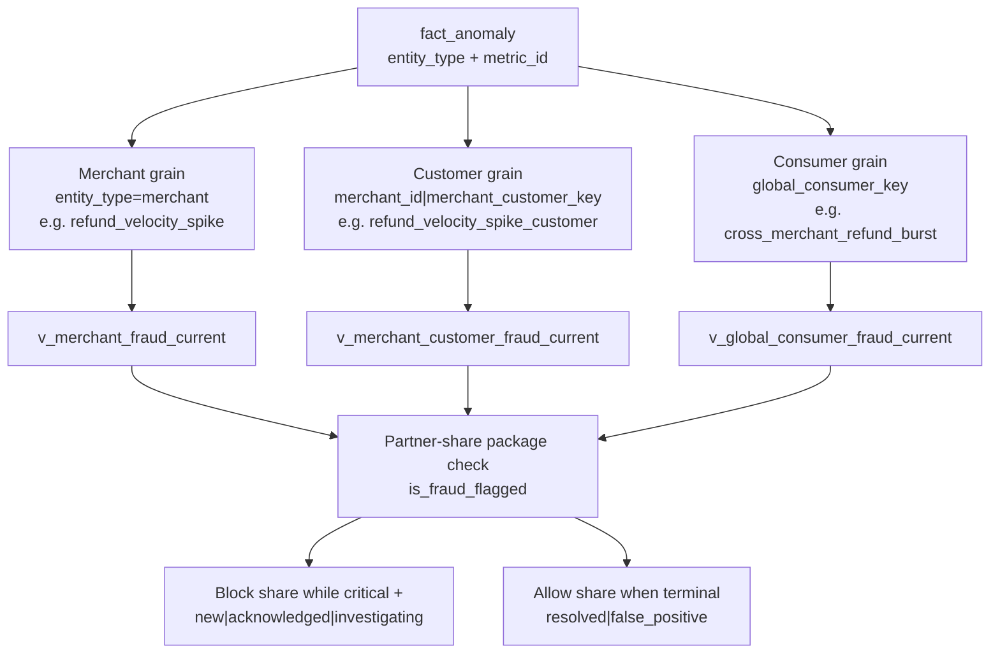
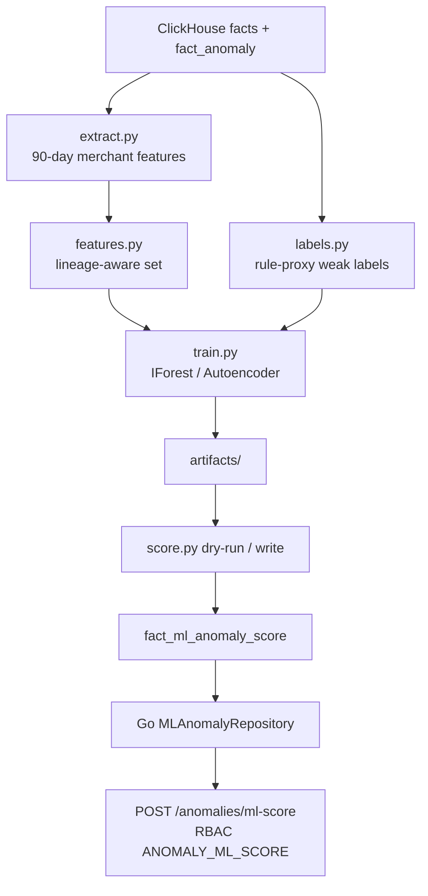
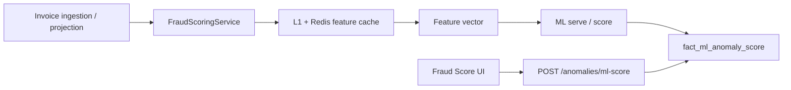
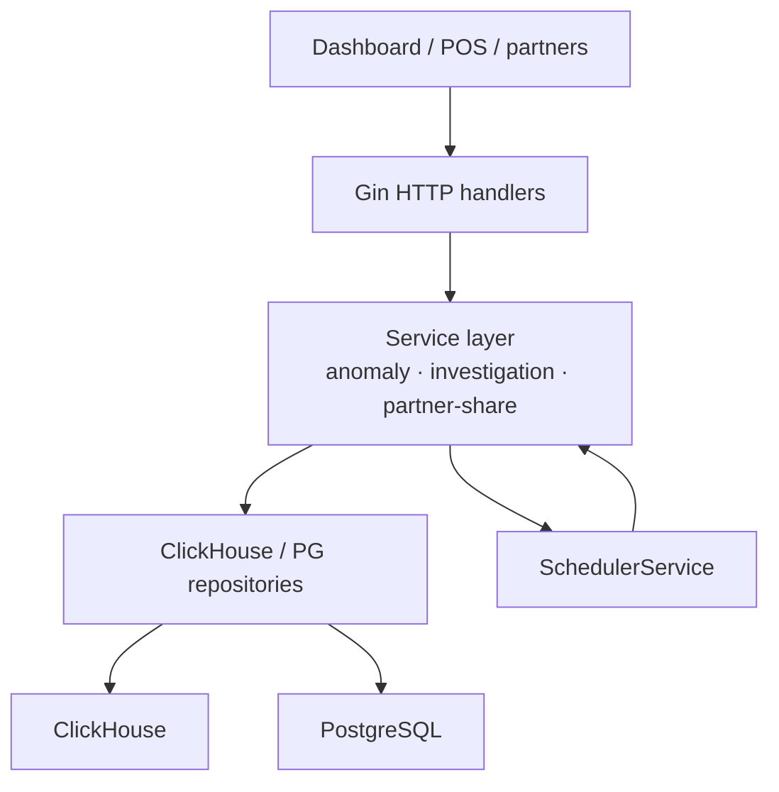
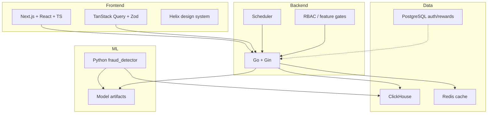

# Ashmeet Singh Sandhu — QueueBuster / Helix Portfolio Context

**Role:** Intern / Engineer — Fraud & Anomaly Detection (Track T6)  
**Product:** QueueBuster Helix (`qb-helix`)  
**Mentor:** Nikhil Jha  
**Focus:** Deterministic fraud signals → ML shadow scoring → real-time scoring → investigation workflow → partner-share (Swayam) three-grain gates  

Use this document for portfolio writing, interview storytelling, and exporting diagrams (Mermaid → PNG/SVG via [mermaid.live](https://mermaid.live), Notion, or VS Code Mermaid preview).

---

## 1. High-level introduction (copy-ready)

### What is QueueBuster?

**QueueBuster** is a multi-merchant retail / POS commerce platform. Merchants run billing, inventory, payments, and store operations across many locations. Transactional systems (e.g. billing / POS APIs) record *what happened at the till*; they are not built to answer *cross-merchant risk, analytics, or partner-lending questions* at scale.

### What is Helix?

**Helix** is QueueBuster’s **multi-tenant intelligence, analytics, and rewards platform**. It:

1. **Ingests** commerce and operational events (invoices, payments, settlements, registry, stock, heartbeats).
2. **Resolves** them into canonical entities in **ClickHouse** (facts + marts).
3. **Exposes** governed analytics via APIs, dashboards, studios, exports, WebSockets, and an AI assistant.
4. Optionally runs **Rewards** on PostgreSQL (+ Kafka) for programs, wallets, and decisioning.

In one line: *billing/POS systems remain the system of operational record; Helix is the system of analytical and risk intelligence.*

### Why fraud / anomaly detection matters for QueueBuster

Helix already sees refunds, cashiers, settlements, and cross-merchant consumer keys. That makes it the right place to:

- flag **refund abuse**, **cashier collusion**, **settlement structuring**, and **cross-merchant bursts**;
- feed **partner-share / lending gates** (e.g. Swayam Risk Engine / T3 — “high-fraud → do not share”);
- open **investigation cases** for analysts instead of leaving raw anomalies unread;
- add a **shadow ML ranker** without blocking production ingestion.

Your work sits on that path: **detect → persist anomaly → investigate → gate partner share → (later) score in real time**.

---

## 2. Helix platform features (map of the product)

| Module | What it does |
|--------|----------------|
| Ingestion & ETL | Invoice, settlement, registry, heartbeat, stock; identity resolution; reconcile / backfill |
| Analytics & studios | Merchant/partner/region/customer analytics; Sales Breakdown, Promotion, Global Studio, Assessment |
| Semantic catalog | Governed metrics/dimensions for APIs + AI |
| Intelligence | Stock/risk/exception reports, alerts, digests |
| AI assistant | Scoped tool-calling over analytics |
| **Anomalies & investigations** | Rules, `fact_anomaly`, acknowledge/resolve, **investigation cases** |
| **Fraud signals (your track)** | Deterministic SQL metrics → anomalies → partner-share views |
| **ML fraud shadow (your track)** | Isolation Forest / Autoencoder → `fact_ml_anomaly_score` |
| Registry & governance | Chains, stores, devices, licenses, users, scheduler |
| Rewards | Programs, wallets, ledgers, decisioning |
| AuthZ / plans | Scope-aware RBAC, feature gates |

---

## 3. What *you* built — journey at a glance

### Portfolio one-liner

> Built QueueBuster Helix’s **fraud detection stack** end-to-end: taxonomy → deterministic ClickHouse SQL signals → scheduler wiring → ML shadow anomaly ranking → investigation audit workflow → merchant/customer/consumer partner-share gates — with Go APIs, Next.js ops UI, and production-minded review fixes (authz, tenant isolation, lifecycle integrity).

### PR map

| PR | Theme | State (as of journey) |
|----|--------|------------------------|
| [#48](https://github.com/MapleGraph/qb-helix/pull/48) | Refund velocity spike (signal #1) | Merged |
| [#164](https://github.com/MapleGraph/qb-helix/pull/164) | Settlement structuring, cashier collusion, cross-merchant refund | Merged |
| [#176](https://github.com/MapleGraph/qb-helix/pull/176) | Week 4 ML shadow (`fraud_detector` + Go read API) | Open |
| Week 5 branch `feat/fraud-realtime-scoring` | RT invoice-driven scoring + Fraud Score UI + Redis cache | Not yet PR / stack on #176 |
| [#211](https://github.com/MapleGraph/qb-helix/pull/211) | Week 6 investigation workflow + audit trail | Open |
| [#188](https://github.com/MapleGraph/qb-helix/pull/188) | Week 7 three-grain rules + Swayam partner-share gates | Open |

### Week-by-week keypoints

| Week | Deliverable | Why it mattered |
|------|-------------|-----------------|
| **W1** | Fraud taxonomy (archetypes, feasibility, case-readiness, data anchors) | Scoped what Helix *can* detect from real ClickHouse columns |
| **W2** | `refund_velocity_spike` live (PR #48) | First production-grade deterministic signal → `fact_anomaly` |
| **W3** | Signals 2–4 (PR #164): settlement structuring, cashier collusion, cross-merchant burst | Breadth of merchant + consumer risk patterns |
| **W4** | ML shadow pipeline (PR #176): Python train/score + `fact_ml_anomaly_score` + `POST /anomalies/ml-score` | Unsupervised anomaly *rank* using rule-derived weak labels — shadow only |
| **W5** | Real-time scoring path + Fraud Score UI + L1/Redis cache | Invoice-driven scoring latency path (depends on #176) |
| **W6** | Investigation workflow (PR #211): auto-open critical → steps → resolve-with-note → audit ledger | Ops can close the loop on critical fraud |
| **W7** | Three-grain fraud (PR #188): customer/consumer rules + partner-share views + terminal gate | Swayam can block share at merchant / customer / consumer grain |

### Impact on QueueBuster (business)

1. **Risk visibility** — Merchants with abnormal refund/settlement/cashier patterns surface as anomalies instead of silent data.  
2. **Partner / lender trust** — Partner-share packages can respect `is_fraud_flagged` until a case is terminal (`resolved` / `false_positive`).  
3. **Analyst workflow** — Critical signals become investigation cases with an append-only audit trail.  
4. **Safe ML adoption** — Shadow scores do not rewrite ingestion; rules remain the explainable gate.  
5. **Multi-tenant correctness** — Review cycles forced store/PRIMARY joins, authz, and stable `detected_at` so re-detect does not wipe analyst state.

---

## 4. Technical stack you touched

| Layer | Tech |
|-------|------|
| Backend | Go (Gin), services, repositories, scheduler |
| Analytics DB | ClickHouse (`fact_anomaly`, fraud views, ML score table, investigation tables) |
| ML | Python (`ml/projects/fraud_detector`) — Isolation Forest / Autoencoder, features, labels, CI tests |
| Frontend | Next.js (investigations UI; Fraud Score UI on Week 5 branch) |
| Infra patterns | Migrations, RBAC features, partner-share views, Redis cache (RT path) |

---

## 5. Architecture diagrams (export these as images)

> Tip: paste each Mermaid block into https://mermaid.live → **Actions → PNG/SVG**.

### Diagram A — Helix platform (high level)

### Diagram B — Your fraud track end-to-end (product story)

### Diagram C — How #176 and #188 fit together (data plane)

### Diagram D — Deterministic signal pipeline (implementation)

### Diagram E — Investigation workflow (Week 6)

### Diagram F — Three-grain Swayam contract (Week 7)

### Diagram G — ML shadow training / scoring (Week 4)

### Diagram H — Real-time scoring path (Week 5)

### Diagram I — Layered Helix service shape (context)

---

## 6. Feature deep-dive — what you own in Helix

### 6.1 Deterministic fraud signals

**Built:** SQL metrics registered in `FraudMetricRegistry`, executed via ClickHouse, mapped to `fact_anomaly` with reason codes, severity, evidence JSON, stable anomaly IDs.

**Examples:**

- `refund_velocity_spike` — refund rate vs baseline (merchant).  
- `settlement_amount_structuring` — settlement splitting patterns.  
- `cashier_collusion` — cashier concentration / pair-lock variants.  
- `cross_merchant_refund_burst` — consumer-level multi-merchant burst.  
- Week 7 person grain: `refund_velocity_spike_customer/consumer`, `cashier_collusion_pair_lock`, `person_smurf_*`.

**Engineering lessons (portfolio gold):** map keying bugs, auth on `/detect`, `payment_pos_date` vs `pos_date`, store + `PRIMARY` observation joins, stable `detected_at` for ReplacingMergeTree, `fraudMu` to serialize heavy scans.

### 6.2 ML shadow anomaly ranking (PR #176)

**Built:** Python `fraud_detector` project + Go read path. Not a calibrated “fraud probability” — an **anomaly rank** trained with rule-derived weak labels.

**Portfolio framing:** unsupervised ML + weak supervision + production safety (shadow-only, GLOBAL_ONLY authz, honest evaluation claims).

### 6.3 Real-time scoring + UI (Week 5 branch)

**Built:** invoice-driven scoring service, Redis/L1 cache for p95, Fraud Score dashboard page.

**Dependency:** stacked on #176’s score table/API. Intentionally removed from Week 7 PR so grains stay separate from ML UI.

### 6.4 Investigation workflow (PR #211)

**Built:**

- Migration: `resolution_note` / `resolved_by` / `resolved_at` + `fact_investigation_event`.  
- Auto-open on critical detect (best-effort).  
- Dedup by `(trigger_type, trigger_ref)`.  
- UI: list queue, detail, resolve-with-note, audit trail.

### 6.5 Partner-share three-grain gates (PR #188)

**Built:** views + Go flag APIs for merchant / merchant-customer / consumer; terminal disposition gate so acknowledged/investigating critical alerts still block share.

**Business hook:** enables “high-fraud subject → do not share package with partner/lender.”

---

## 7. Challenges faced (and how they were handled)

These are real blockers from reviews, rebases, and multi-PR work — strong interview stories.

### 7.1 Data correctness under real ClickHouse grains

| Challenge | What went wrong | What I learned / fixed |
|-----------|-----------------|------------------------|
| **Row-collapse data loss** | Mapping fraud query results by `merchant_id` only dropped store/day rows (e.g. 25 → 16) | Return slices; key by full grain (`merchant+store+date+mode`) |
| **Wrong column name** | Person-grain SQL used `fact_invoice_payment.pos_date`; schema has `payment_pos_date` | Always verify columns against live schema / contract tests |
| **Store fan-out** | Customer joins omitted `store_id` + PRIMARY observation role → false anomalies | Join full grain + `customer_role = 'PRIMARY'` |
| **ReplacingMergeTree lifecycle** | Re-detect with `status=new` overwrote analyst acknowledge/investigate state | Stable `detected_at` from anomaly ID (`fraudSignalDetectedAt`) |

### 7.2 Security, authz, and product boundaries

| Challenge | What went wrong | What I learned / fixed |
|-----------|-----------------|------------------------|
| **Unauthenticated detect** | `POST /anomalies/detect` on public routes → expensive CH scan DoS | Gate with RBAC (`ANOMALY_DETECT`); remove from public group |
| **ML score exposure** | Score treated too openly; PARTNER/merchant nav vs GLOBAL_ONLY | Align feature keys (`ANOMALY_ML_SCORE`), GLOBAL-only surfaces |
| **Week-5 UI on Week-7 PR** | Fraud Score page bundled into three-grain PR → incompatible with #176 | Split ownership: rules ≠ ML UI; remove UI from #188 |

### 7.3 Multi-PR dependency & Git reality

| Challenge | What went wrong | What I learned / fixed |
|-----------|-----------------|------------------------|
| **#176 vs #188 coupling** | UI expected nested DTO / wrong model version vs flat Go API | Shared contract first; or remove UI until RT PR |
| **Rebase / merge conflicts** | Scheduler + partner-share migrations conflicted with newer `dev` | Keep `dev` view definitions; keep Week-7 scheduler marts (union) |
| **Stacked work** | Week 5 RT needs #176 table/API; opening vs bare `dev` is incomplete | Stacked PR on #176 head, or wait for merge then rebase |
| **Stale merge base** | Unrelated migrations / reconcile stubs crashed builds | Rebase early; drop unrelated files; fix test stubs |

### 7.4 Ops, CI, and local environment

| Challenge | What went wrong | What I learned / fixed |
|-----------|-----------------|------------------------|
| **Scheduler vs ingestion** | Overlapping fraud scans can contend on same CH cluster | In-process `fraudMu`; seed schedules disabled; avoid unbounded prod scans |
| **Partner-share bypass** | Only `status=new` blocked share; acknowledged/investigating became shareable | Terminal gate: block while `new\|acknowledged\|investigating` |
| **DS conformance CI** | `pnpm ds:check` failed on repo-wide ratchet (support/marketing), not investigation logic | Don’t re-freeze baseline in feature PR; fix own UI debt; escalate platform drift |
| **Disk / Go cache (Windows)** | Local `go test` failed mid-run (full disk on C:) | Point `GOTMPDIR` / `GOCACHE` to larger drive |

### 7.5 Product / scope challenges

- **Taxonomy vs data:** several archetypes (BNPL, device trust) were red/amber — ship green signals first.  
- **Merchant vs person grain:** Swayam needed customer/consumer flags without replacing merchant gates.  
- **ML honesty:** cannot claim “fraud probability” or leakage-free evaluation without holdout discipline — reframe as anomaly *rank* / shadow.  
- **Mentor review culture:** rushing commits without explaining blockers wasted cycles; “explain → agree → implement → commit” became the working rhythm.

---

## 8. New learnings

### 8.1 Engineering mindset

- **Rules before models** — explainable SQL gates earn trust; ML is additive shadow.  
- **Contracts beat clever code** — OpenAPI/DTO alignment across Go ↔ TS ↔ Python prevents “works on my branch” UI.  
- **Grain is everything** — wrong join grain is a silent correctness bug, worse than a loud crash.  
- **Shadow / fail-open carefully** — detection auto-open is best-effort; partner-share flags must fail closed when critical.  
- **PR hygiene** — one concern per PR (signals ≠ ML UI ≠ investigations) survives review and rebases.

### 8.2 Tech-stack learnings (by layer)

#### Go (Helix API)

- Layered Gin handlers → services → ClickHouse repos.  
- Interface stubs must track interface changes or CI packages fail to compile.  
- RBAC middleware pattern: module + feature constants (e.g. `ANOMALY_DETECT`, `ANOMALY_ML_SCORE`).  
- Mutex serialization for heavy background jobs (`fraudMu`).  
- Table-driven tests for lifecycle / partner-share gate semantics.

#### ClickHouse

- `FINAL` + `ReplacingMergeTree` semantics for mutable case/anomaly rows.  
- Append-only **event ledgers** when history must survive replacements (`fact_investigation_event`).  
- Views as the partner-facing contract (`v_*_fraud_current`).  
- Timestamped migrations; never fight `dev`’s newer view definitions blindly.  
- Column naming discipline (`payment_pos_date` vs header `pos_date`).

#### SQL fraud engineering

- Baselines, sigma / share thresholds, min-volume guards, divide-by-zero safety.  
- Evidence JSON for case-ready signals (invoice IDs, cashiers, windows).  
- Reason-code vocabulary as the bridge to investigations and partner disclosure.

#### Python ML (`fraud_detector`)

- Feature extraction + lineage; chronological holdout; weak labels from rules.  
- Isolation Forest / Autoencoder as ranking, not calibrated probability.  
- Artifact I/O, dry-run scoring, pytest in CI (`PYTHONPATH` / import packaging).  
- Honest eval claims under review pressure.

#### Next.js / TypeScript UI

- Investigations list + detail: status transitions, resolve-with-note, audit trail.  
- TanStack Query mutations for button-driven lookups.  
- Scope/nav feature keys must match backend entitlements.  
- Design-system ratchet: prefer `@/ds` over raw `<select>` / deep `@/components/ui/*`.

#### Git / GitHub / team delivery

- Rebase onto `origin/dev` before opening; force-with-lease after history rewrite.  
- Stacked PRs for dependent work (#176 → Week 5).  
- Review reply docs + E2E checklists make mentor re-review faster.  
- PowerShell quoting pitfalls (`(authenticated)` paths).

#### Collaboration & process

- Memory docs + taxonomy before coding.  
- Claude/Cursor for planning prompts; human owns merge decisions.  
- Split “plan agent” vs “implement agent” when scope is large (Week 7 three-grain).

---

## 9. Working with the team — brainstorm & collaboration

### 9.1 People / roles in the loop

| Role | How I interacted |
|------|------------------|
| **Mentor (Nikhil)** | Blocker-level PR reviews; authz, SQL grain, lifecycle, DS policy |
| **Swayam (partner-share / T3)** | Consumer of fraud flags — merchant → customer → consumer contract |
| **Platform / Helix** | Shared `dev`, migrations, design-system CI, ingestion constraints |
| **AI pair agents** | Research plans, conflict resolution drafts — I still reviewed before commit |

### 9.2 How we brainstormed (patterns that worked)

1. **Taxonomy first** — archetypes × data feasibility × case-readiness (Week 1 doc).  
2. **Seed rule packs** — RV / CC / SS / CM families; drop red-feasibility ideas early.  
3. **Architecture prompts** — written plans for three-grain + partner-share before coding.  
4. **Review-driven design** — REQUEST CHANGES docs became the backlog (not ego).  
5. **Vertical demos** — signal → anomaly → investigation → gate, not only SQL in isolation.  
6. **Explicit non-goals** — “ML doesn’t auto-block lenders in Week 4”; “UI isn’t Week 7.”

### 9.3 Ideas that came from brainstorming (kept vs deferred)

| Idea | Outcome |
|------|---------|
| Refund velocity (merchant) | Shipped (#48) |
| Settlement structuring / cashier / cross-merchant | Shipped (#164) |
| Customer/consumer person grain + Swayam views | Shipped path (#188) |
| Investigation auto-open on critical | Shipped (#211) |
| ML shadow ranker | Shipped path (#176) |
| Real-time score + UI | Built on Week 5 branch; stack after #176 |
| Device-hop / BNPL stacking / emulator spoof | Deferred (data gaps) |
| Tax-smurfing inside settlement SQL | Rejected — sibling person-smurf on invoice/payment instead |

### 9.4 Communication habits that reduced thrash

- Paste review bullets → status table (fixed / deferred / needs ops evidence).  
- Ask before force-push / amend.  
- Separate “explain the fix” from “run git commit.”  
- Keep reply markdown (`pr188-rereview-reply.md`, Week 6 PR body) for mentors.

---

## 10. Full tech stack used to build Helix fraud work

Use this as a **skills / stack** section on a portfolio site.

### 10.1 Languages & runtimes

| Tech | Where used |
|------|------------|
| **Go 1.25.x** | API, services, scheduler, repositories, handlers, tests |
| **Python 3** | `ml/projects/fraud_detector` train / evaluate / score / serve |
| **TypeScript / TSX** | Next.js investigations + Fraud Score UI |
| **SQL (ClickHouse dialect)** | Fraud metrics, views, migrations, validation queries |

### 10.2 Backend & APIs

| Tech | Where used |
|------|------------|
| **Gin** | HTTP routing, protected anomaly / investigation routes |
| **qb-helix cmd** | Local server (`go run ./cmd`), wiring |
| **RBAC / authz catalog** | Feature gates, plan lint exemptions |
| **Swagger / OpenAPI docs** | Public API surface (platform-wide) |

### 10.3 Data stores & messaging

| Tech | Where used |
|------|------------|
| **ClickHouse** | Facts, marts, `fact_anomaly`, ML scores, investigations, partner views |
| **PostgreSQL** | Platform auth / rewards (adjacent Helix modules) |
| **Redis** | Week 5 RT feature cache (L1 + Redis) |
| **Kafka** | Optional rewards path (platform context; not core fraud write path) |

### 10.4 ML / data science

| Tech | Where used |
|------|------------|
| **scikit-learn-style IForest / Autoencoder stack** | Shadow anomaly ranking |
| **Feature lineage & holdout eval** | Review-hardened training discipline |
| **pytest** | ML unit/smoke tests in CI |
| **Artifact files** | Model versioning for score API (`iforest_v10`, etc.) |

### 10.5 Frontend

| Tech | Where used |
|------|------------|
| **Next.js 16** | Helix dashboard app (`web/`) |
| **React 19** | Investigations pages, intel shells |
| **TanStack Query** | List/detail/mutations |
| **Zod schemas** | API response contracts (`phase3`, fraud DTOs) |
| **Design system (`@/ds`)** | Target for compliant UI (CI ratchet) |
| **Tailwind / CSS variables** | Theming / severity bars |

### 10.6 Tooling, quality & delivery

| Tech | Where used |
|------|------------|
| **Git / GitHub PRs** | #48, #164, #176, #188, #211 |
| **gh CLI** | PR create/view, checks |
| **go test / gofmt** | Backend verification |
| **npm / pnpm** | Web install, `ds:check`, `ds:conformance` |
| **GitHub Actions** | CI (Go, web, ML, design-system) |
| **Docker Compose** | Local rewards infra (platform) |
| **Mermaid** | Architecture diagrams for docs/portfolio |
| **Cursor / Claude** | Planning agents, conflict assistance (human-gated) |

### 10.7 Domain / product stack (non-language)

| Concept | Where used |
|---------|------------|
| Multi-tenant scope (GLOBAL / MERCHANT / PARTNER) | AuthZ + nav |
| Reason codes & severity | Anomaly → investigation → partner disclosure |
| Partner-share packages (Swayam T3) | Fraud gate views |
| Shadow vs enforce | ML never blocks ingestion |
| ReplacingMergeTree + audit ledger | Mutable case row + immutable history |

### 10.8 Stack diagram (portfolio visual)

---

## 11. Portfolio talking points (short bullets)

- Owned a **vertical slice** in a production multi-tenant Go + ClickHouse + Next.js platform.  
- Shipped **merged** fraud PRs (#48, #164) and drove open PRs through **senior review cycles**.  
- Designed **explainable** rules first; added ML as **shadow**, not a black-box blocker.  
- Connected detection to **ops** (investigations) and **business gates** (partner share).  
- Practiced production correctness: **tenant isolation**, **authz**, **lifecycle integrity**, **scheduler contention**.  
- Survived hard challenges: grain bugs, rebase conflicts, cross-PR contracts, CI ratchets.  
- Collaborated via taxonomy → plan → review-driven iteration with mentor and partner-share consumers.  
- Wrote contracts/checklists mentors can re-run (Week 6 E2E checklist, review reply docs).

---

## 12. Suggested portfolio project title & blurb

**Title:** *Helix Fraud Intelligence — From Deterministic Signals to Partner-Share Gates*

**Blurb (≈80 words):**  
At QueueBuster I built Helix’s fraud track: ClickHouse SQL detectors for refund velocity, settlement structuring, cashier collusion, and cross-merchant bursts; a Python Isolation Forest / Autoencoder shadow scorer with a Go read API; an investigation case workflow with audit ledger and Next.js UI; and merchant/customer/consumer partner-share fraud gates for lender packaging. The system turns POS facts into actionable risk without rewriting the ingestion pipeline.

**Challenges blurb (optional second paragraph):**  
Along the way I fixed silent multi-store data loss, ClickHouse column/grain bugs, unauthenticated detect endpoints, ReplacingMergeTree lifecycle overwrites, and multi-PR rebase conflicts — learning to treat reviews as the product backlog and to keep ML UI, rules, and investigations in separate shippable slices.

---

## 13. Key repo paths (for demos / screenshots)

| Area | Paths |
|------|--------|
| Registry / SQL metrics | `internal/services/fraud_metric_registry*.go` |
| Anomaly model / ToAnomaly | `internal/models/fraud_signal.go` |
| Scheduler | `internal/services/scheduler_service.go` |
| Partner-share views | `schema/migrations/clickhouse/20260714T09000*.sql`, `20260722T120000_partner_share_fraud_terminal_gate.sql` |
| ML project | `ml/projects/fraud_detector/` |
| ML API | `internal/transport/http/handlers/anomaly_handler.go`, `internal/models/ml_anomaly.go` |
| Investigations | `internal/services/investigation_service.go`, `web/src/app/(authenticated)/investigations/` |
| Taxonomy | `docs/fraud-taxonomy-week1.md` |
| Week 6 checklist | `docs/week6-investigation-workflow-e2e-checklist.md` |
| This portfolio doc | `docs/portfolio/ashmeet-sandhu-helix-fraud-journey.md` |

---

## 14. How to use this file

1. **Portfolio site:** copy §1, §3, §7–§8, §11–§12; attach PNG exports of diagrams A, B, E, F, G + stack diagram §10.8.  
2. **Interview deep-dive:** walk Diagram B left→right; tell one challenge story from §7.  
3. **Resume bullets:** 3 bullets from §11 + “Merged PRs #48, #164; authored #176, #188, #211.”  
4. **Skills section:** paste §10 tables.  
5. **Team / culture answers:** use §9 brainstorm + communication habits.  
6. **Image export:** Mermaid Live → download SVG for decks.

---

*Generated for portfolio context from the qb-helix fraud track (Weeks 1–7). Update PR states after merges.*
